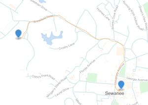

Personal route maps for god knows what.

---

#### HOW DO YOU CAPTURE AND MAP ROUTES?

Yeah, here's one quick way to track and map your routes with an iPhone.

1. Get a route tracking iPhone app like [MapOut](http://www.mapoutapp.com).

2. Record your route.

3. Email the captured [GPX](http://en.wikipedia.org/wiki/GPS_Exchange_Format) route data to yourself and save to disk (`route.gpx`).

4. Convert your GPX file to geojson with `togeojson` (`togeojson route.gpx >
   route.geojson`).

5. Save resulting geojson file as [a gist](https://gist.github.com/joyrexus/213cad1bc2570bcee6e2), render it with leaflet, or upload to [geojson.io](http://geojson.io/) (`geojsonio route.geojson`).
